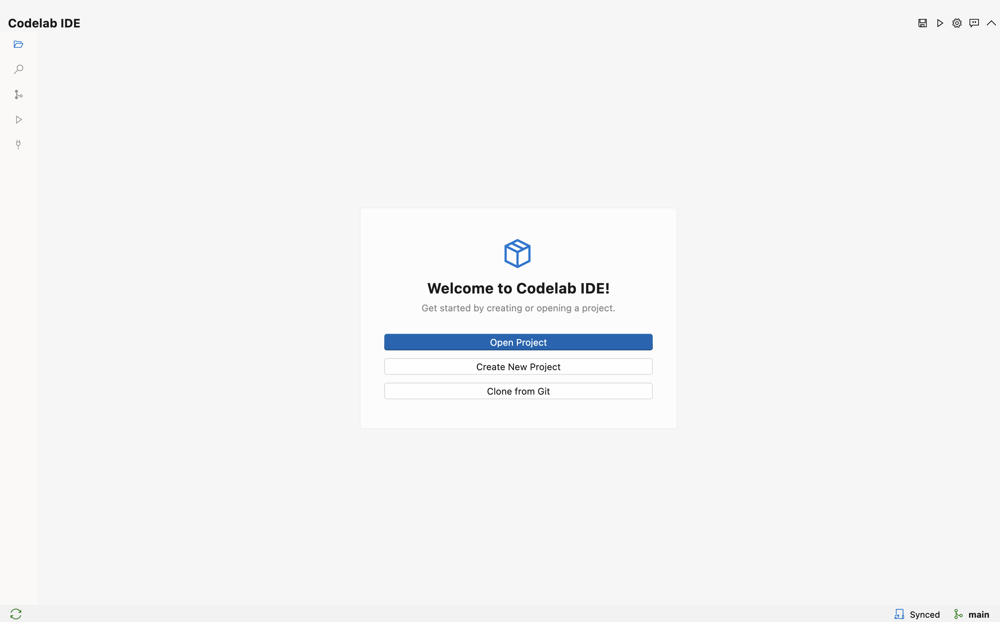
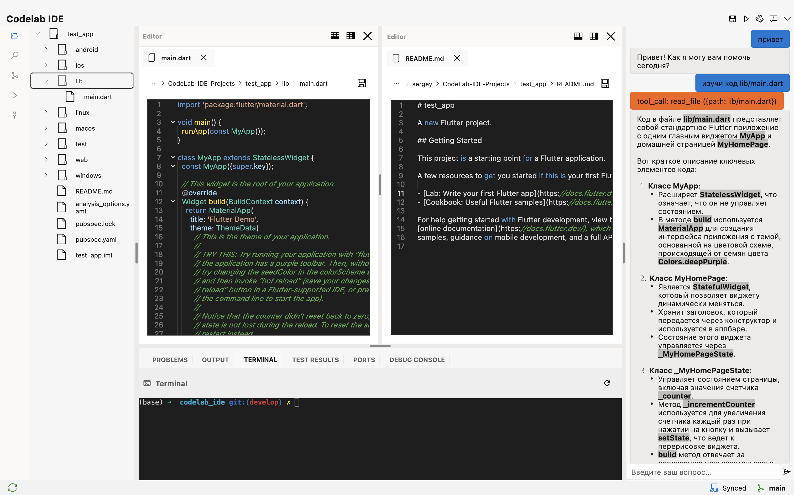

# CodeLab IDE

Кроссплатформенная AI-powered IDE, построенная на Flutter для эффективной разработки. Использует модульную монорепозиторную архитектуру с управлением через Melos и интегрируется с мультиагентной AI системой.

**Версия**: 1.0 (MVP)
**Дата обновления**: 11 января 2026
**Статус**: ✅ Production Ready

## Возможности

### ✅ Реализованные функции (v1.0 MVP)

**Основной функционал:**
- **Навигация по дереву файлов** - Просмотр и навигация по структуре проекта
- **Редактор кода** - Редактирование файлов с подсветкой синтаксиса для 10+ языков
- **Встроенный терминал** - Выполнение команд и запуск скриптов с PTY поддержкой
- **Кроссплатформенность** - Работает на Windows, Linux и macOS
- **Модульная архитектура** - Чистое разделение ответственности (6 packages)

**AI Ассистент:**
- **WebSocket интеграция** - Подключение к AI Service через Gateway
- **Мультиагентная система** - Работа с 5 специализированными агентами
- **HITL (Human-in-the-Loop)** - Контроль опасных операций через диалоги
- **Session persistence** - Сохранение истории диалогов
- **Tool execution** - Локальное выполнение инструментов (read_file, write_file, execute_command и др.)

**Архитектурные паттерны:**
- **BLoC Pattern** - Управление состоянием с предсказуемыми переходами
- **Dependency Injection** - CherryPick для тестируемого кода
- **Functional Programming** - FPDart (Either, TaskEither) для обработки ошибок
- **Clean Architecture** - Разделение на Presentation, Domain, Data слои

## Скриншоты

### Приветственный экран



*Приветственный экран с возможностью открыть существующий проект, создать новый или клонировать из Git репозитория.*

### Главный интерфейс с AI ассистентом



*Основной интерфейс IDE с открытым проектом, редактором кода с подсветкой синтаксиса Dart, встроенным терминалом и AI ассистентом для помощи в разработке.*


## Поддерживаемые языки

IDE поддерживает подсветку синтаксиса для:
- **Dart** - полная поддержка
- **Python** - полная поддержка
- **JavaScript/TypeScript** - полная поддержка
- **Java** - полная поддержка
- **C/C++** - полная поддержка
- **HTML/CSS** - полная поддержка
- **JSON/YAML** - полная поддержка
- **Markdown** - полная поддержка
- **И многие другие...**

## Настройка окружения для разработки

### Системные требования

#### Общие требования
- **Dart SDK**: версия 3.10.1 или выше
- **Flutter SDK**: версия 3.38.5 (рекомендуется использовать FVM)
- **Git**: для клонирования репозитория
- **Минимум 4 GB RAM** (рекомендуется 8 GB)
- **Свободное место на диске**: минимум 5 GB

#### Требования для Windows
- **ОС**: Windows 10 или выше (64-bit)
- **Visual Studio 2022** или **Visual Studio Build Tools 2022**
  - Компоненты: "Desktop development with C++"
  - Windows 10 SDK
- **PowerShell 5.0** или выше

#### Требования для macOS
- **ОС**: macOS 10.15 (Catalina) или выше
- **Xcode**: версия 13.0 или выше
- **CocoaPods**: для управления зависимостями
  ```bash
  sudo gem install cocoapods
  ```
- **Command Line Tools для Xcode**:
  ```bash
  xcode-select --install
  ```

#### Требования для Linux
- **ОС**: Ubuntu 20.04 LTS или выше (или эквивалентный дистрибутив)
- **Необходимые библиотеки**:
  ```bash
  sudo apt-get update
  sudo apt-get install -y \
    clang cmake ninja-build pkg-config \
    libgtk-3-dev liblzma-dev libstdc++-12-dev
  ```

### Установка Flutter с использованием FVM (рекомендуется)

FVM (Flutter Version Management) позволяет управлять несколькими версиями Flutter в одном проекте.

#### 1. Установка FVM

**macOS/Linux:**
```bash
# Используя Homebrew (macOS)
brew tap leoafarias/fvm
brew install fvm

# Или используя Dart pub
dart pub global activate fvm
```

**Windows:**
```powershell
# Используя Chocolatey
choco install fvm

# Или используя Dart pub
dart pub global activate fvm
```

#### 2. Настройка переменных окружения

Добавьте путь к глобальным пакетам Dart в PATH:

**macOS/Linux (bash/zsh):**
```bash
# Добавьте в ~/.bashrc или ~/.zshrc
export PATH="$PATH":"$HOME/.pub-cache/bin"
```

**Windows:**
```powershell
# Добавьте в переменные окружения системы:
# %USERPROFILE%\AppData\Local\Pub\Cache\bin
```

### Установка проекта

#### 1. Клонирование репозитория

```bash
git clone <repository-url>
cd codelab_ide
```

#### 2. Установка Flutter через FVM

```bash
# Установить версию Flutter, указанную в .fvmrc
fvm install

# Использовать установленную версию
fvm use 3.38.5
```

#### 3. Установка Melos

Melos используется для управления монорепозиторием:

```bash
dart pub global activate melos
```

#### 4. Инициализация workspace

```bash
# Установить зависимости для всех пакетов
melos bootstrap
```

Эта команда:
- Установит все зависимости для каждого пакета
- Создаст симлинки между локальными пакетами
- Выполнит необходимую кодогенерацию

#### 5. Генерация кода (если требуется)

```bash
# Запустить build_runner для всех пакетов
melos generate
```

## Запуск IDE

### Запуск в режиме разработки

**Используя Melos (рекомендуется):**
```bash
melos run:codelab_ide
```

**Используя Flutter напрямую:**
```bash
cd apps/codelab_ide
fvm flutter run
```

**Выбор конкретной платформы:**
```bash
# macOS
fvm flutter run -d macos

# Windows
fvm flutter run -d windows

# Linux
fvm flutter run -d linux
```

### Запуск с hot reload

При запуске через `flutter run` автоматически включается hot reload:
- Нажмите `r` для hot reload
- Нажмите `R` для hot restart
- Нажмите `q` для выхода

## Сборка проекта

### Сборка для Windows

**Требования:**
- Visual Studio 2022 с компонентами C++
- Windows 10 SDK

**Команды сборки:**
```bash
cd apps/codelab_ide

# Debug сборка
fvm flutter build windows --debug

# Release сборка
fvm flutter build windows --release

# Profile сборка (для профилирования)
fvm flutter build windows --profile
```

**Результат сборки:**
```
apps/codelab_ide/build/windows/x64/runner/Release/
├── codelab_ide.exe          # Исполняемый файл
├── flutter_windows.dll      # Flutter runtime
└── data/                    # Ресурсы приложения
```

**Запуск собранного приложения:**
```bash
.\apps\codelab_ide\build\windows\x64\runner\Release\codelab_ide.exe
```

### Сборка для macOS

**Требования:**
- Xcode 13.0 или выше
- CocoaPods
- Подписанный сертификат разработчика (для распространения)

**Команды сборки:**
```bash
cd apps/codelab_ide

# Debug сборка
fvm flutter build macos --debug

# Release сборка
fvm flutter build macos --release

# Profile сборка
fvm flutter build macos --profile
```

**Результат сборки:**
```
apps/codelab_ide/build/macos/Build/Products/Release/
└── codelab_ide.app          # macOS приложение
```

**Запуск собранного приложения:**
```bash
open apps/codelab_ide/build/macos/Build/Products/Release/codelab_ide.app
```

**Создание DMG для распространения:**
```bash
# Установить create-dmg
brew install create-dmg

# Создать DMG
create-dmg \
  --volname "CodeLab IDE" \
  --window-pos 200 120 \
  --window-size 800 400 \
  --icon-size 100 \
  --app-drop-link 600 185 \
  "CodeLab-IDE.dmg" \
  "apps/codelab_ide/build/macos/Build/Products/Release/codelab_ide.app"
```

### Сборка для Linux

**Требования:**
- Установленные системные библиотеки (см. раздел "Требования для Linux")
- clang, cmake, ninja-build

**Команды сборки:**
```bash
cd apps/codelab_ide

# Debug сборка
fvm flutter build linux --debug

# Release сборка
fvm flutter build linux --release

# Profile сборка
fvm flutter build linux --profile
```

**Результат сборки:**
```
apps/codelab_ide/build/linux/x64/release/bundle/
├── codelab_ide              # Исполняемый файл
├── lib/                     # Библиотеки
└── data/                    # Ресурсы приложения
```

**Запуск собранного приложения:**
```bash
./apps/codelab_ide/build/linux/x64/release/bundle/codelab_ide
```

**Создание AppImage для распространения:**
```bash
# Установить appimagetool
wget https://github.com/AppImage/AppImageKit/releases/download/continuous/appimagetool-x86_64.AppImage
chmod +x appimagetool-x86_64.AppImage

# Создать структуру AppDir
mkdir -p AppDir/usr/bin
cp -r apps/codelab_ide/build/linux/x64/release/bundle/* AppDir/usr/bin/

# Создать .desktop файл
cat > AppDir/codelab_ide.desktop << EOF
[Desktop Entry]
Name=CodeLab IDE
Exec=codelab_ide
Icon=codelab_ide
Type=Application
Categories=Development;
EOF

# Создать AppImage
./appimagetool-x86_64.AppImage AppDir CodeLab-IDE-x86_64.AppImage
```

## Команды разработки

```bash
# Запустить IDE
melos run:codelab_ide

# Запустить все тесты
melos test

# Запустить тесты конкретного пакета
melos test --scope=codelab_core

# Генерация кода (freezed, json_serializable и т.д.)
melos generate

# Проверить устаревшие зависимости
melos outdated

# Очистить build артефакты
melos clean

# Форматирование кода
melos format

# Анализ кода
melos analyze
```

## Решение проблем

### Проблемы с FVM

**Проблема:** `fvm: command not found`
```bash
# Убедитесь, что путь к pub-cache добавлен в PATH
echo $PATH | grep pub-cache  # macOS/Linux
echo %PATH% | findstr pub-cache  # Windows
```

**Проблема:** FVM не находит Flutter SDK
```bash
# Переустановите Flutter через FVM
fvm install 3.38.5 --force
fvm use 3.38.5
```

### Проблемы с Melos

**Проблема:** `melos: command not found`
```bash
# Переустановите Melos
dart pub global activate melos
```

**Проблема:** Ошибки при `melos bootstrap`
```bash
# Очистите кэш и попробуйте снова
melos clean
rm -rf .dart_tool
melos bootstrap
```

### Проблемы сборки на Windows

**Проблема:** Ошибки компиляции C++
- Убедитесь, что установлен Visual Studio 2022 с компонентами C++
- Проверьте, что Windows 10 SDK установлен

**Проблема:** `CMake not found`
```powershell
# Установите CMake через Visual Studio Installer
# или скачайте с https://cmake.org/download/
```

### Проблемы сборки на macOS

**Проблема:** Ошибки CocoaPods
```bash
# Обновите CocoaPods
sudo gem install cocoapods
pod repo update

# Очистите кэш
cd apps/codelab_ide/macos
rm -rf Pods Podfile.lock
pod install
```

**Проблема:** Ошибки подписи кода
```bash
# Для разработки можно отключить подписывание
# В Xcode: Signing & Capabilities -> Signing -> Automatically manage signing
```

### Проблемы сборки на Linux

**Проблема:** Отсутствуют библиотеки
```bash
# Установите все необходимые зависимости
sudo apt-get update
sudo apt-get install -y clang cmake ninja-build pkg-config \
  libgtk-3-dev liblzma-dev libstdc++-12-dev
```

**Проблема:** Ошибки GTK
```bash
# Установите дополнительные GTK библиотеки
sudo apt-get install -y libgtk-3-dev libglib2.0-dev
```

## Дополнительные инструменты разработки

### VS Code расширения (рекомендуется)

- **Dart** - Поддержка языка Dart
- **Flutter** - Поддержка Flutter framework
- **Melos Code** - Поддержка Melos monorepo

### Полезные команды Flutter

```bash
# Проверить установку Flutter
fvm flutter doctor

# Список доступных устройств
fvm flutter devices

# Очистить build кэш
fvm flutter clean

# Обновить зависимости
fvm flutter pub get

# Запустить анализатор
fvm flutter analyze
```

## Структура проекта

Проект использует монорепозиторную архитектуру, управляемую через Melos:

```
codelab_ide/
├── apps/
│   └── codelab_ide/                 # Основное Flutter приложение
│       ├── lib/
│       │   ├── main.dart            # Точка входа приложения
│       │   ├── codelab_app.dart     # Корневой виджет с настройкой DI
│       │   ├── pages/               # Страницы приложения
│       │   └── widgets/             # Специфичные виджеты приложения
│       └── pubspec.yaml             # Зависимости приложения
├── packages/
│   ├── codelab_core/                # Основные сервисы и модели
│   │   ├── lib/src/
│   │   │   ├── services/            # FileService, ProjectService, RunService
│   │   │   ├── models/              # FileNode, ProjectConfig
│   │   │   ├── errors/              # AppError, FileError
│   │   │   └── utils/               # Logger, ProjectContext
│   │   └── pubspec.yaml
│   ├── codelab_engine/              # Бизнес-логика и UI виджеты
│   │   ├── lib/src/
│   │   │   ├── project_bloc.dart    # Основное управление состоянием проекта
│   │   │   └── widgets/             # Editor, FileTree, Terminal и т.д.
│   │   └── pubspec.yaml
│   ├── codelab_terminal/            # Реализация терминала
│   │   ├── lib/src/widgets/         # Виджет терминала и bloc
│   │   └── pubspec.yaml
│   ├── codelab_uikit/               # UI компоненты и темы
│   │   ├── lib/src/                 # Базовые UI компоненты
│   │   ├── example/                 # Пример приложения с Fluent UI
│   │   └── pubspec.yaml
│   ├── codelab_ai_assistant/        # Интеграция AI ассистента
│   │   ├── lib/src/                 # Реализация AI ассистента
│   │   └── pubspec.yaml
│   └── codelab_version_control/     # Интеграция Git
│       ├── lib/src/                 # Сервисы контроля версий
│       └── pubspec.yaml
├── pubspec.yaml                     # Конфигурация workspace
└── melos.yaml                       # Конфигурация Melos monorepo
```

## Использование

1. **Открыть проект**: Нажмите на иконку папки в панели инструментов для открытия директории проекта
2. **Навигация по файлам**: Используйте панель дерева файлов для просмотра и открытия файлов
3. **Редактирование кода**: Пишите и редактируйте код в редакторе с подсветкой синтаксиса
4. **Сохранение файлов**: Используйте Ctrl+S (Cmd+S на macOS) или кнопку сохранения
5. **Выполнение команд**: Используйте панель терминала для выполнения команд и скриптов
6. **Запуск текущего файла**: Нажмите кнопку воспроизведения для выполнения открытого файла

## Пример проекта

Проверьте директорию `example_project/` для примеров файлов, демонстрирующих возможности IDE:
- `hello.dart` - Пример на Dart
- `example.py` - Пример на Python
- `README.md` - Документация проекта

## Архитектура и технологический стек

### Основные технологии
- **Flutter/Dart** - Кроссплатформенный UI фреймворк
- **Melos** - Управление монорепозиторием и инструменты
- **BLoC** - Управление состоянием с предсказуемыми переходами
- **CherryPick** - Внедрение зависимостей для тестируемого кода
- **FPDart** - Утилиты функционального программирования (Either, TaskEither)
- **Freezed** - Генерация кода для неизменяемых классов данных

### Ключевые зависимости

#### Основные пакеты
- `flutter_bloc` & `bloc` - Управление состоянием
- `fpdart` - Паттерны функционального программирования
- `cherrypick` - Внедрение зависимостей
- `freezed_annotation` & `freezed` - Неизменяемые классы данных

#### Файловая система и UI
- `file_picker` - Выбор файлов и директорий
- `file` & `path` - Операции с файловой системой
- `fluent_ui` - UI компоненты в стиле Windows (в codelab_uikit)

#### Редактирование кода
- `flutter_code_editor` - Продвинутое редактирование кода с подсветкой синтаксиса
- `code_text_field` - Виджеты редактора кода
- `highlight` & `flutter_highlight` - Подсветка синтаксиса

#### Терминал и выполнение
- `xterm` - Эмуляция терминала
- `process_run` - Выполнение команд
- `logger` - Структурированное логирование

### Зависимости для разработки
- `build_runner` - Генерация кода
- `melos` - Инструменты для монорепозитория
- `cherrypick_generator` - Генерация кода для DI

## Разработка

### Текущий статус (v1.0 MVP - Январь 2026)

Проект достиг статуса **MVP (Minimum Viable Product)** с полным набором базовых функций и интеграцией с AI Service.

### ✅ Реализованные функции

**Основной функционал:**
- ✅ **Модульная архитектура** - 6 packages с чистым разделением ответственности
- ✅ **Управление файлами** - Загрузка проектов, навигация по дереву, операции с файлами
- ✅ **Редактор кода** - Подсветка синтаксиса для 10+ языков (Dart, Python, JS/TS, Java, C/C++, HTML/CSS, JSON/YAML, Markdown)
- ✅ **Интеграция терминала** - xterm с PTY поддержкой, выполнение команд
- ✅ **Управление состоянием** - BLoC pattern с неизменяемыми состояниями
- ✅ **Dependency Injection** - CherryPick для тестируемого кода
- ✅ **Кроссплатформенность** - Windows, Linux, macOS
- ✅ **UI компоненты** - Fluent UI design system

**AI Ассистент (полная интеграция):**
- ✅ **WebSocket клиент** - Подключение к Gateway Service
- ✅ **Мультиагентная система** - Поддержка 5 агентов (Orchestrator, Coder, Architect, Debug, Ask)
- ✅ **Agent switching** - Автоматическое и ручное переключение агентов
- ✅ **HITL dialogs** - Диалоги подтверждения опасных операций
- ✅ **Tool execution** - Локальное выполнение 9 инструментов
- ✅ **Session persistence** - Сохранение истории через SharedPreferences
- ✅ **Streaming responses** - Token-by-token отображение ответов

**Packages:**
- ✅ `codelab_core` - FileService, ProjectService, GlobalConfigService
- ✅ `codelab_engine` - EditorManagerService, LSPService, FileSyncService
- ✅ `codelab_ai_assistant` - WebSocket client, multi-agent support, HITL
- ✅ `codelab_terminal` - TerminalWidget с xterm
- ✅ `codelab_uikit` - UI компоненты, темы, AI assistant UI
- ✅ `codelab_version_control` - Git интеграция (базовая)

### 🚧 В разработке (Q1 2026)

- 🚧 **LSP интеграция** - Language Server Protocol для автодополнения
- 🚧 **Продвинутая Git интеграция** - Commit, push, pull, merge
- 🚧 **Multi-tab editor** - Редактирование нескольких файлов одновременно
- 🚧 **Code navigation** - Go to definition, find references

### 📋 Запланировано (Q2-Q4 2026)

**Q2 2026:**
- Visual Debugger - Отладка с breakpoints
- Performance profiling - Профилирование производительности
- Code refactoring tools - Инструменты рефакторинга

**Q3 2026:**
- Plugin system - Расширяемая архитектура
- Custom themes - Пользовательские темы
- Collaborative editing - Совместное редактирование

**Q4 2026:**
- Package manager UI - Управление зависимостями
- Project templates - Шаблоны проектов
- Integrated testing - Запуск тестов из IDE

### 📚 Документация

**Основная документация:**
- [Getting Started](../website/docs/getting-started/quick-start.md) - Быстрый старт
- [IDE Architecture](../website/docs/architecture/ide-architecture.md) - Архитектура IDE
- [Development Guide](../website/docs/development/ide.md) - Руководство разработчика

**Интеграционные гайды:**
- [Auth Integration](../website/docs/guides/auth-integration.md) - Интеграция с Auth Service
- [Multi-Agent Integration](../website/docs/guides/multi-agent-integration.md) - Интеграция с мультиагентной системой

**Техническая документация:**
- [AI Agent UI Plan](doc/ai_agent_ui_plan_panel.md) - План UI для AI ассистента
- [HITL IDE Integration](doc/HITL_IDE_INTEGRATION_PLAN.md) - Интеграция HITL
- [Multi-Agent UI Integration](doc/multi-agent-ui-integration-plan.md) - UI для мультиагентной системы

### Участие в разработке

Проект использует:
- **Conventional Commits** - Стандартизированные сообщения коммитов
- **Clean Code** - Принципы чистого кода
- **Test-Driven Development** - Разработка через тестирование
- **Code Review** - Обязательный review перед merge

Каждый package независимо тестируется и может разрабатываться изолированно.

## Лицензия

```
MIT License

Copyright (c) 2025 CodeLab IDE

Permission is hereby granted, free of charge, to any person obtaining a copy
of this software and associated documentation files (the "Software"), to deal
in the Software without restriction, including without limitation the rights
to use, copy, modify, merge, publish, distribute, sublicense, and/or sell
copies of the Software, and to permit persons to whom the Software is
furnished to do so, subject to the following conditions:

The above copyright notice and this permission notice shall be included in all
copies or substantial portions of the Software.

THE SOFTWARE IS PROVIDED "AS IS", WITHOUT WARRANTY OF ANY KIND, EXPRESS OR
IMPLIED, INCLUDING BUT NOT LIMITED TO THE WARRANTIES OF MERCHANTABILITY,
FITNESS FOR A PARTICULAR PURPOSE AND NONINFRINGEMENT. IN NO EVENT SHALL THE
AUTHORS OR COPYRIGHT HOLDERS BE LIABLE FOR ANY CLAIM, DAMAGES OR OTHER
LIABILITY, WHETHER IN AN ACTION OF CONTRACT, TORT OR OTHERWISE, ARISING FROM,
OUT OF OR IN CONNECTION WITH THE SOFTWARE OR THE USE OR OTHER DEALINGS IN THE
SOFTWARE.
```
