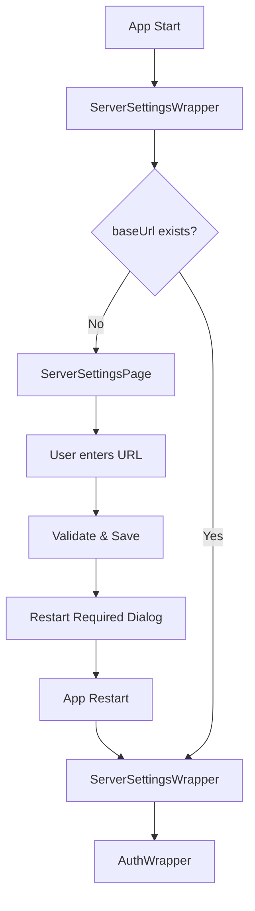
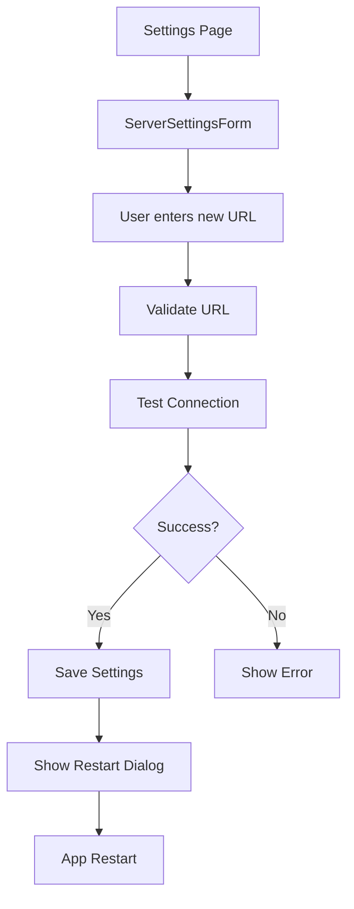
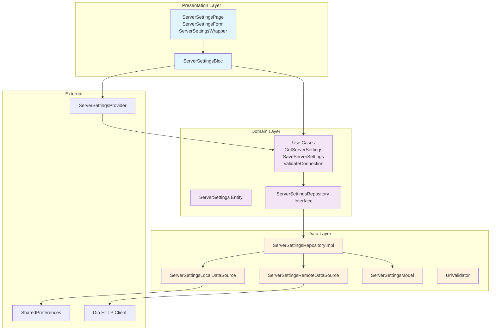

# Архитектура Feature Server Settings

## Обзор

Feature `server_settings` предназначен для управления настройками сервера AI Assistant в приложении CodeLab IDE. Реализует проверку baseUrl при первом запуске, валидацию URL, тестирование соединения и динамическое обновление настроек в DI контейнере.

## Архитектура

Проект использует **Clean Architecture** с **Feature-First** подходом, **BLoC + Freezed** для управления состоянием и **CherryPick** для DI.

### Структура Feature

```
lib/features/server_settings/
├── data/
│   ├── datasources/
│   │   ├── server_settings_local_datasource.dart
│   │   └── server_settings_remote_datasource.dart
│   ├── models/
│   │   └── server_settings_model.dart
│   ├── repositories/
│   │   └── server_settings_repository_impl.dart
│   └── services/
│       └── url_validator.dart
├── domain/
│   ├── entities/
│   │   └── server_settings.dart
│   ├── repositories/
│   │   └── server_settings_repository.dart
│   └── usecases/
│       ├── get_server_settings.dart
│       ├── save_server_settings.dart
│       └── validate_server_connection.dart
├── presentation/
│   ├── bloc/
│   │   └── server_settings_bloc.dart
│   ├── pages/
│   │   └── server_settings_page.dart
│   ├── widgets/
│   │   └── server_settings_wrapper.dart
│   └── molecules/
│       └── server_settings_form.dart
```

## Классы и Ответственности

### Domain Layer

#### ServerSettings (Entity)
```dart
@freezed
class ServerSettings with _$ServerSettings {
  const factory ServerSettings({
    required String baseUrl,
  }) = _ServerSettings;
}
```
**Ответственность**: Представляет бизнес-сущность настроек сервера.

#### ServerSettingsRepository (Interface)
```dart
abstract class ServerSettingsRepository {
  Future<ServerSettings> getSettings();
  Future<void> saveSettings(ServerSettings settings);
  Future<bool> validateConnection(String url);
}
```
**Ответственность**: Контракт для работы с настройками сервера.

#### Use Cases
- **GetServerSettingsUseCase**: Получение текущих настроек
- **SaveServerSettingsUseCase**: Сохранение настроек
- **ValidateServerConnectionUseCase**: Проверка доступности сервера

### Data Layer

#### ServerSettingsModel (Model)
```dart
@freezed
class ServerSettingsModel with _$ServerSettingsModel {
  const factory ServerSettingsModel({
    required String baseUrl,
  }) = _ServerSettingsModel;

  factory ServerSettingsModel.fromJson(Map<String, dynamic> json) =>
      _$ServerSettingsModelFromJson(json);
}
```
**Ответственность**: Модель для сериализации/десериализации данных.

#### ServerSettingsLocalDataSource
```dart
abstract class ServerSettingsLocalDataSource {
  Future<ServerSettingsModel?> getSettings();
  Future<void> saveSettings(ServerSettingsModel model);
}
```
**Ответственность**: Работа с локальным хранилищем (SharedPreferences).

#### ServerSettingsRemoteDataSource
```dart
abstract class ServerSettingsRemoteDataSource {
  Future<bool> testConnection(String url);
}
```
**Ответственность**: Тестирование соединения с сервером.

#### UrlValidator (Service)
```dart
class UrlValidator {
  static bool isValidUrl(String url) {
    // Регулярное выражение для валидации URL
  }
}
```
**Ответственность**: Валидация формата URL.

### Presentation Layer

#### ServerSettingsBloc
```dart
@freezed
class ServerSettingsState with _$ServerSettingsState {
  const factory ServerSettingsState.initial() = _Initial;
  const factory ServerSettingsState.loading() = _Loading;
  const factory ServerSettingsState.loaded(ServerSettings settings) = _Loaded;
  const factory ServerSettingsState.validating() = _Validating;
  const factory ServerSettingsState.valid() = _Valid;
  const factory ServerSettingsState.invalid(String error) = _Invalid;
  const factory ServerSettingsState.error(String message) = _Error;
}

@freezed
class ServerSettingsEvent with _$ServerSettingsEvent {
  const factory ServerSettingsEvent.load() = _Load;
  const factory ServerSettingsEvent.save(String baseUrl) = _Save;
  const factory ServerSettingsEvent.validate(String url) = _Validate;
  const factory ServerSettingsEvent.urlChanged(String url) = _UrlChanged;
}
```
**Ответственность**: Управление состоянием feature server_settings.

#### ServerSettingsWrapper
```dart
class ServerSettingsWrapper extends StatefulWidget {
  final Widget child;

  const ServerSettingsWrapper({required this.child, super.key});

  @override
  State<ServerSettingsWrapper> createState() => _ServerSettingsWrapperState();
}
```
**Ответственность**: Обертка для проверки настроек сервера перед показом основного приложения. Аналог AuthWrapper.

#### ServerSettingsPage
```dart
class ServerSettingsPage extends StatelessWidget {
  const ServerSettingsPage({super.key});

  @override
  Widget build(BuildContext context) {
    return Scaffold(
      body: Center(
        child: Container(
          constraints: const BoxConstraints(maxWidth: 400),
          padding: AppSpacing.paddingXl,
          child: ServerSettingsForm(),
        ),
      ),
    );
  }
}
```
**Ответственность**: Страница настройки сервера.

#### ServerSettingsForm
```dart
class ServerSettingsForm extends StatefulWidget {
  const ServerSettingsForm({super.key});

  @override
  State<ServerSettingsForm> createState() => _ServerSettingsFormState();
}
```
**Ответственность**: Форма ввода и валидации baseUrl.

## ServerSettingsProvider

```dart
class ServerSettingsProvider extends ChangeNotifier {
  String? _baseUrl;

  String? get baseUrl => _baseUrl;

  Stream<String?> get baseUrlStream => _baseUrlController.stream;
  final _baseUrlController = StreamController<String?>.broadcast();

  void updateBaseUrl(String newUrl) {
    _baseUrl = newUrl;
    _baseUrlController.add(newUrl);
    notifyListeners();
  }

  @override
  void dispose() {
    _baseUrlController.close();
    super.dispose();
  }
}
```
**Ответственность**: Provider для динамического обновления baseUrl в DI контейнере.

## Flow Диаграммы

### Первый Запуск


### Изменение Настроек


## Диаграмма Структуры Feature



## План Интеграции

### 1. Регистрация в DI
Добавить в `AiAssistantModule`:

```dart
// Provider для baseUrl
bind<ServerSettingsProvider>()
    .toProvide(() => ServerSettingsProvider())
    .singleton();

// Data Sources
bind<ServerSettingsLocalDataSource>()
    .toProvide(() => ServerSettingsLocalDataSourceImpl(sharedPreferences!))
    .singleton();

bind<ServerSettingsRemoteDataSource>()
    .toProvide(() => ServerSettingsRemoteDataSourceImpl())
    .singleton();

// Repository
bind<ServerSettingsRepository>()
    .toProvide(() => ServerSettingsRepositoryImpl(
          localDataSource: currentScope.resolve(),
          remoteDataSource: currentScope.resolve(),
        ))
    .singleton();

// Use Cases
bind<GetServerSettingsUseCase>()
    .toProvide(() => GetServerSettingsUseCase(currentScope.resolve()))
    .singleton();

bind<SaveServerSettingsUseCase>()
    .toProvide(() => SaveServerSettingsUseCase(currentScope.resolve()))
    .singleton();

bind<ValidateServerConnectionUseCase>()
    .toProvide(() => ValidateServerConnectionUseCase(currentScope.resolve()))
    .singleton();

// Bloc
bind<ServerSettingsBloc>()
    .toProvide(() => ServerSettingsBloc(
          getSettings: currentScope.resolve(),
          saveSettings: currentScope.resolve(),
          validateConnection: currentScope.resolve(),
          provider: currentScope.resolve(),
        ))
    .singleton();
```

### 2. Обновление AiAssistantModule
Изменить конструктор для использования ServerSettingsProvider:

```dart
class AiAssistantModule extends Module {
  final ServerSettingsProvider settingsProvider;

  AiAssistantModule({required this.settingsProvider});

  @override
  void builder(Scope currentScope) {
    // Gateway API URL
    bind<String>()
        .withName('gatewayBaseUrl')
        .toProvide(() => '${settingsProvider.baseUrl}/api/v1')
        .singleton();
    // ... остальные bindings
  }
}
```

### 3. Обновление App Entry Point
В `main.dart` или корневом виджете:

```dart
void main() async {
  // Инициализация DI
  final settingsProvider = ServerSettingsProvider();
  final module = AiAssistantModule(settingsProvider: settingsProvider);

  // Создание scope
  final scope = CherryPick.openScope(module: module);

  runApp(
    ServerSettingsWrapper(
      child: AuthWrapper(
        child: MyApp(),
      ),
    ),
  );
}
```

### 4. Добавление в Настройки
Добавить пункт "Настройки сервера" в главное меню или панель настроек приложения.

## Примеры Кода

### ServerSettingsWrapper Implementation
```dart
class _ServerSettingsWrapperState extends State<ServerSettingsWrapper> {
  @override
  void initState() {
    super.initState();
    context.read<ServerSettingsBloc>().add(const ServerSettingsEvent.load());
  }

  @override
  Widget build(BuildContext context) {
    return BlocBuilder<ServerSettingsBloc, ServerSettingsState>(
      builder: (context, state) {
        return state.when(
          initial: () => const Center(child: ProgressRing()),
          loading: () => const Center(child: ProgressRing()),
          loaded: (_) => widget.child,
          validating: () => const Center(child: ProgressRing()),
          valid: () => widget.child,
          invalid: (error) => ServerSettingsPage(),
          error: (message) => ServerSettingsPage(),
        );
      },
    );
  }
}
```

### ServerSettingsForm Implementation
```dart
class _ServerSettingsFormState extends State<ServerSettingsForm> {
  final _formKey = GlobalKey<FormState>();
  final _urlController = TextEditingController();

  @override
  Widget build(BuildContext context) {
    return BlocConsumer<ServerSettingsBloc, ServerSettingsState>(
      listener: (context, state) {
        state.whenOrNull(
          error: (message) => context.showError(message),
          valid: () => context.showSuccess('Настройки сохранены'),
        );
      },
      builder: (context, state) {
        final isLoading = state.maybeWhen(
          validating: () => true,
          orElse: () => false,
        );

        return Form(
          key: _formKey,
          child: Column(
            children: [
              TextInputField(
                controller: _urlController,
                label: 'Base URL сервера',
                placeholder: 'https://api.example.com',
                validator: (value) {
                  if (value == null || value.isEmpty) {
                    return 'Введите URL сервера';
                  }
                  if (!UrlValidator.isValidUrl(value)) {
                    return 'Некорректный формат URL';
                  }
                  return null;
                },
              ),
              AppSpacing.gapVerticalXl,
              PrimaryButton(
                onPressed: isLoading ? null : _handleSave,
                isLoading: isLoading,
                child: const Text('Сохранить'),
              ),
            ],
          ),
        );
      },
    );
  }

  void _handleSave() {
    if (_formKey.currentState?.validate() ?? false) {
      context.read<ServerSettingsBloc>().add(
            ServerSettingsEvent.save(_urlController.text.trim()),
          );
    }
  }
}
```

## Тестирование

- Unit тесты для use cases, repository, bloc
- Widget тесты для форм и страниц
- Integration тесты для полного flow первого запуска
- Тесты валидации URL и тестирования соединения

## Безопасность

- Валидация URL на клиенте
- HTTPS обязательное требование для production
- Логирование ошибок без чувствительных данных

## Производительность

- Ленивая загрузка настроек только при необходимости
- Кеширование результатов валидации
- Минимальное количество HTTP запросов для тестирования соединения